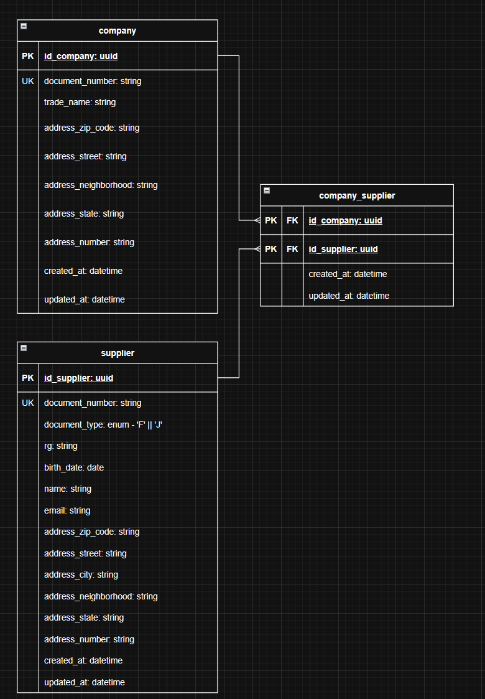

# Enterprise Hub

Sistema full stack desenvolvido com **Angular 21** no frontend e **Java 21 + Spring Boot 4.1.0** no backend, utilizando
**PostgreSQL** como banco de dados.

## Tecnologias Utilizadas

### Frontend

- **Angular 21** — Framework para desenvolvimento de aplicações web SPA.
- **Bootstrap** — Biblioteca CSS para criação de interfaces responsivas.
- **Jasmine** — Framework utilizado para testes unitários no frontend.

### Backend

- **Java 21** — Linguagem principal da aplicação.
- **Spring Boot 4.1.0** — Framework para desenvolvimento rápido de aplicações Java.
- **Spring Data JPA** — Abstração para acesso e persistência de dados.
- **Hibernate** — Implementação JPA responsável pelo mapeamento objeto-relacional.
- **JUnit** — Framework para testes automatizados no backend.

### Banco de Dados

- **PostgreSQL** — Banco de dados relacional utilizado para armazenamento das informações.

---

## Como Executar

Para subir toda a aplicação utilizando Docker:

```bash
docker compose up --build
```

Após a conclusão do processo, os serviços estarão disponíveis conforme a configuração definida no arquivo
`docker-compose.yml`.

---

## Modelagem do Banco de Dados

A estrutura do banco foi modelada conforme o diagrama abaixo:



---

## Collection para o postman

Todos os enpoints estão nessa collection: [postman_collection](backend/postman_collection.json)

---

## Decisões Técnicas

Durante o desenvolvimento, algumas decisões arquiteturais e de implementação foram tomadas com base no escopo do projeto
e em critérios de simplicidade, manutenção e produtividade.

### Utilização do JPA em vez de JDBC manual

Foi adotado o **Spring Data JPA** para persistência dos dados, pois ele reduz significativamente a quantidade de código
boilerplate, aumenta a produtividade e facilita a manutenção da aplicação.

Apesar de possuir conhecimento para implementar toda a camada de persistência utilizando JDBC e SQL manualmente, o
escopo do projeto permitia a utilização de uma solução mais produtiva e amplamente adotada no mercado.

---

### Hibernate para criação do schema

Considerei utilizar ferramentas de migração de banco de dados, como o Flyway, para versionamento do schema e criação das
tabelas.

Entretanto, para manter a simplicidade do projeto e reduzir complexidade desnecessária, optei por utilizar o Hibernate
na geração automática das estruturas do banco.

Em um cenário de produção ou em projetos de maior porte, a utilização de migrations versionadas seria a abordagem
recomendada.

---

### Não utilização da anotação `@ManyToMany`

Embora a modelagem possua relacionamentos muitos-para-muitos, a tabela de associação foi projetada com campos de
auditoria, considerados essenciais para rastreabilidade dos dados.

Por esse motivo, foi criada uma entidade específica para representar a tabela de relacionamento, em vez de utilizar
diretamente a anotação `@ManyToMany`.

Essa abordagem permite maior controle sobre a entidade intermediária e evita a necessidade de customizações adicionais
no schema após sua criação.

---

### Integração e validação de CEP

Um dos requisitos do desafio era:

> "Validar CEP na API http://cep.la/api, sendo que a validação também deve ser realizada no Front-end."

Durante a implementação foi identificada uma dificuldade prática: a URL informada não retornava dados em um formato
adequado para consumo pela aplicação (JSON ou XML), inviabilizando sua utilização direta.

Diante disso, optei por utilizar a API do ViaCEP:

```text
https://viacep.com.br/ws/{CEP}/json/
```

Além disso, houve uma interpretação possível do requisito que gerou dúvida:

- Validar se os dados digitados pelo usuário correspondem exatamente aos retornados pela API;
- Ou utilizar o CEP informado para buscar e preencher automaticamente os dados de endereço, comportamento mais comum em
  aplicações reais.

Como não foi possível obter esclarecimento do time responsável durante o desenvolvimento, foi adotada a segunda
abordagem, realizando a consulta do CEP e o preenchimento automático dos campos de endereço.

Em um ambiente corporativo real, essa definição seria alinhada previamente com o time de produto ou com os responsáveis
pelos requisitos antes da implementação.

---

## Considerações Finais

O projeto foi desenvolvido priorizando clareza, simplicidade e manutenibilidade, buscando equilibrar boas práticas de
engenharia de software com a complexidade necessária para atender aos requisitos propostos.
